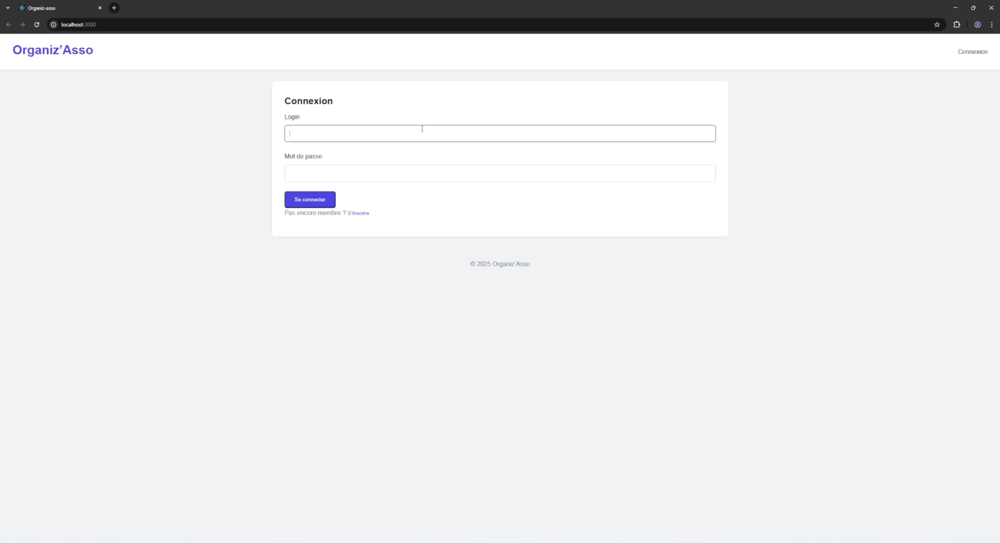
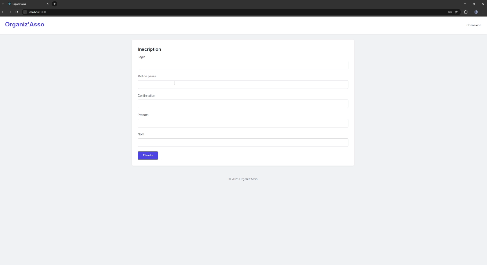

# Organiz-asso — Plateforme de Gestion Associative

> **Projet Universitaire Inidviduel** | Sorbonne Université

## 📌 Présentation

**Organiz-asso** est une plateforme web complète. L'objectif est de fournir à une association un outil pour gérer ses membres et organiser des **forums de discussion** en ligne.

L'application est construite sur une architecture **Fullstack** où l'interface (le Client) est clairement séparée de la logique (le Serveur). Le point central du développement est la **gestion stricte des rôles** (Admin ou Membre) pour contrôler les accès et les permissions.

---

## 📸 Aperçu de l'Application

### 1. Authentification
Système complet d'inscription et de connexion sécurisée.
<p align="center">
  
  
</p>

### 2. Gestion des Rôles (RBAC)
L'interface s'adapte dynamiquement selon que l'utilisateur est **Administrateur** (Alice) ou **Membre** (Micheal).

| Espace Administrateur (Alice) | Espace Membre (Micheal) |
|:---:|:---:|
|  |  |
| *Accès complet : Gestion inscriptions & admins.* | *Accès restreint : Forums, Liste d'amis & profil uniquement.* |

### 3. Forums de Discussion
Un espace d'échange avec lecture des fils de discussion et participation.
<p align="center">
  
  
</p>

---

## 🛠️ Outils Techniques Utilisés (La Stack)

Ce projet repose sur un ensemble de technologies modernes **Fullstack JavaScript** :

* **Interface (Frontend)** : L'interface utilisateur est codée avec **React.js**. Cela permet de construire une seule page (SPA) dynamique.
* **Serveur (Backend)** : Le serveur est géré par **Node.js** et le framework **Express**.
* **Base de Données** : Les données sont stockées dans **MongoDB**, une base de données flexible (NoSQL).
* **Modélisation** : **Mongoose** est utilisé pour organiser et structurer les données.

---

## 🚦 Installation et Démarrage

Suivez ces étapes pour lancer le projet en local.

### 1. Pré-requis
À la racine du projet, installez les dépendances :
```bash
# Installer le serveur
cd server && npm install

# Installer le client
cd ../client && npm install
```

### 2. Lancement du projet
Deux modes de lancement sont possibles.
#### Option A : Mode Unifié (Recommandé)
Si "concurrently" est configuré, lancez le frontend et le backend en une seule commande depuis la racine du projet :
```bash
npm run dev
```
#### Option B : Mode Manuel
Ouvrez deux terminaux séparés :
```bash
# Terminal 1
cd server && npm start
# Terminal 2
cd client && npm start
```
